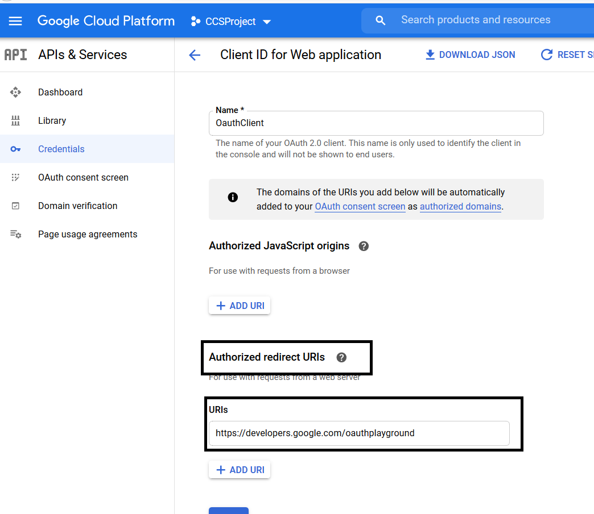
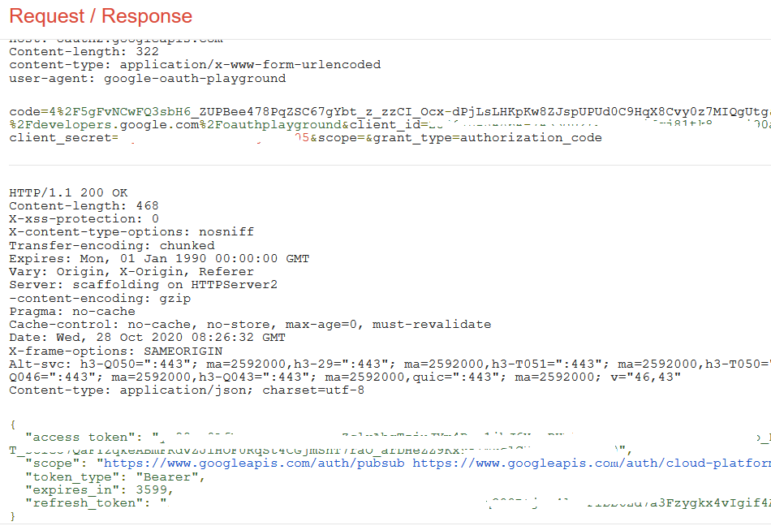

This tutorial describes configuring an oauth account to google pubsub in webMethods.io Workflow

# Setting up Google OAuth 2.0

* 1.  Login to https://console.cloud.google.com with the username and password.
* 2.  From the projects list, select a project or create a new one.
* 3.  If the APIs & services page isn't already open, open the console left side menu and select APIs & services.
* 4.  On the left, click Credentials.
* 5.  Click New Credentials, then select OAuth client ID.
        
      
* 6.  Select the appropriate application type (In this case application type is “web application”) for your project and enter any additional information required.
* 7.  Select “Authorized redirect URI’s” and add the redirect Uri as https://developers.google.com/oauthplayground.
      
* 8.  Hit “Create” the application. And note down the Client Id and Client Secret created.
* 9.  Open the browser and point the browser to google oauth playground https://developers.google.com/oauthplayground.
* 10. On the right corner of the page, click on gear icon and fill in OAuth Client ID and OAuth Client Secret and close.
      
* 11. On left side panel, select the scopes required.
      
* 12. Hit on “Authorize API’s”
      
* 13. Select “Exchange authorization code for tokens”
      
* 14. Note down “Access Token” and “Refresh Token”
      

# Setting up Google OAuth account in webMethods.io Integration Workflow

* 15. Login to wMio Integration tenant and choose your project or click on “+” to create new project.
      
* 16. Select “Create New WorkFlow”
* 17. From the right-hand panel of connectors list. Drag and drop a “Google PubSub Connector”
      
* 18. Click on gear icon on the connector and choose any predefined operation (Ex: listTopics) and click on "+" to add account
      
* 19. Fill in the Client Id, Client Secret obtained from Step 8 and Access Token ,Refresh Token  obtained from Step 14.
      Refresh URL:  https://www.googleapis.com/oauth2/v4/token
      Grant_type :  refresh_token
      
* 20. Click on “Add” and Hit “Next” and pass the required inputs (In this case “listTopics” requires projectId to be passed)
      
* 21. Click on “Save” to run the workflow.
      
      
      

  
